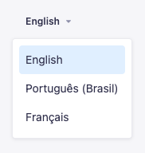

To translate Strapi's V4 admin panel frontend **first make sure** you are running Strapi server using: <br /> `strapi develop --watch-admin` command or else you'll need to run `strapi build` for every change.

_I spent a good 30min until I found out this._

So, go to the file `src/admin/app.js` and add the translates that you need:

```js:title=src/admin/app.js {4,5,6,7}
export default {
  config: {
    // others configs
    locales: [
      "pt-BR",
      "fr"
    ],
  },
};
```

But note that is not possible to remove the English `en` translation because is the Strapi Admin Panel fallback language.

### Overwriting

To overwrite any existing translation add a `translations` key inside the `config` object with the translation key/value of the language. You can see all [Strapi default translations here](https://github.com/strapi/strapi/tree/master/packages/core/admin/admin/src/translations) or inside your project's node_modules `@strapi/admin/admin/src/translations/[language-name].json`.

Here is an example to translate the Strapi navbar title and subtitle:

```js:title=src/admin/app.js {8-16}
export default {
  config: {
    // others configs
    locales: [
      "pt-BR",
      "fr"
    ],
    translations: {
      "pt-BR": {
        "app.components.LeftMenu.navbrand.title": "Painel Admin",
        "app.components.LeftMenu.navbrand.workplace": "mywebsite.com",
      },
      fr: {
        "app.components.LeftMenu.navbrand.title": "Panneau d'administration",
        "app.components.LeftMenu.navbrand.workplace": "mywebsite.com",
      },
    },
  },
};
```

### Result

After following the previous steps you will see language select at your profile page `/admin/me` and the login page.

<p style={{ textAlign: "center" }}>Language select at Login page:</p>



<p style={{ textAlign: "center" }}>Language select at Profile page:</p>


