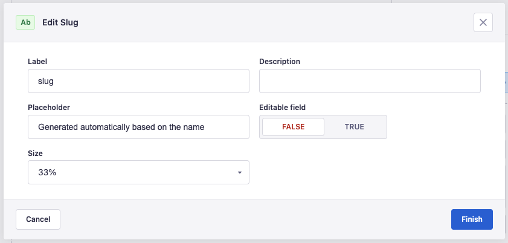

Follow this 2 steps guide to create a slug system with Strapi v4.

## 1. Slug field configuration

> ⚠️ First make sure the slug field is NOT required

Click at the Configure View button inside the Content-Type page:


1. Add the follwing text to the slug's placeholder field:

`Generated automatically based on the [FIELD_TO_SLUGFY]`. In our case `title`

2. Disable the Editable field option clicking in `false`



Save it and let's add the required code to generate the slugs.

## 2. Slug generation with Slugify

First install <a href="https://www.npmjs.com/package/slugify" target="_blank" rel="nofollow">`slugify`</a>

```shell
npm install --save slugify
```

```shell
yarn add slugify
```

After installing we need to update Strapi's lifecycles functions to create/update the slug.

Create a file following this format:

`./src/api/[ENTITY_NAME]/content-types/[ENTITY_NAME]/lifecycles.js`

and add the code bellow to create the slug.

```js:title=./src/api/article/content-types/article/lifecycles.js

const slugify = require("slugify");

module.exports = {
  beforeCreate({ params }) {
    const { data } = params;

    if (data.title) {
      data.slug = slugify(data.title, { lower: true });
    }
  },
  beforeUpdate({ params }) {
    const { data } = params;

    if (data.title) {
      data.slug = slugify(data.title, { lower: true });
    }
  },
};

```

Now we can fetch our content by `slug`:

`http://localhost:1337/api/articles?filters[slug]=my-slug`
